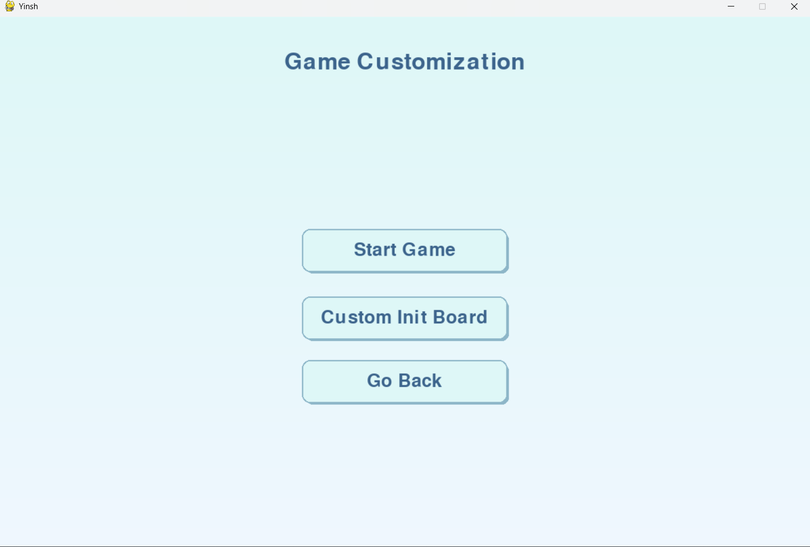
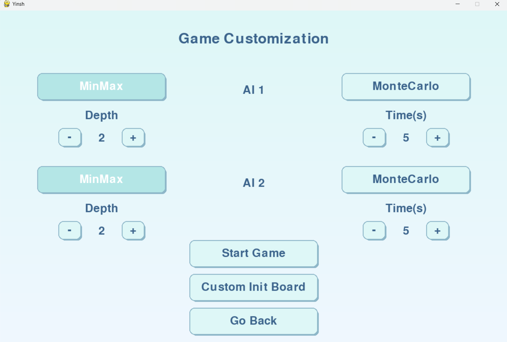
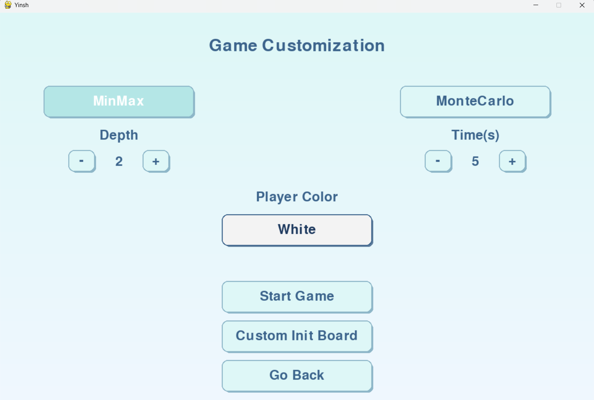
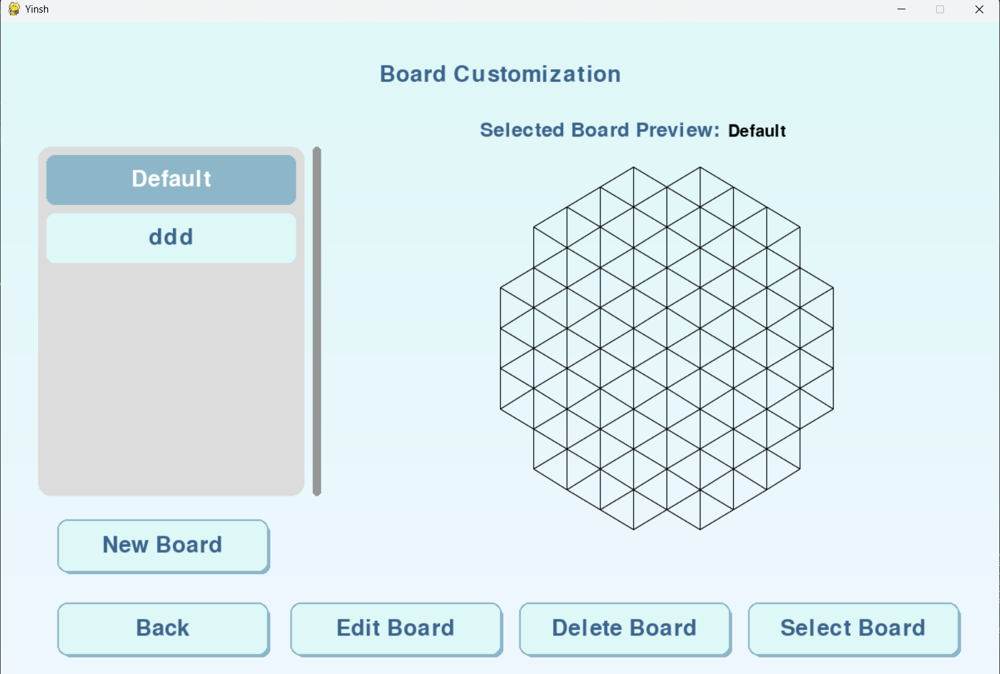
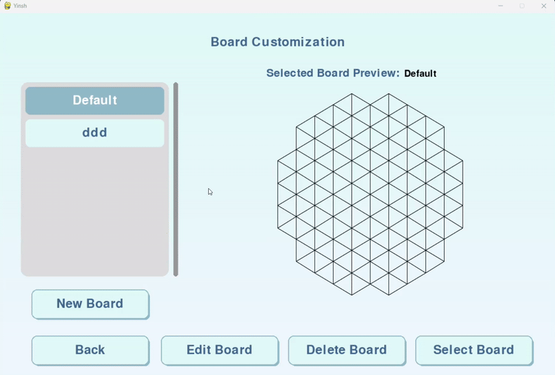

# Running the Program

## Prerequisites
Ensure you have the following installed:
- [Python](https://www.python.org/downloads/) (version 3.x recommended)
- Required dependencies specified in `requirements.txt`

## Installation
1. Clone the repository (if applicable):
   ```sh
   git clone <repository_url>
   cd <repository_name>
   ```
2. Install dependencies:
   ```sh
   pip install -r requirements.txt
   ```

## Running the Program

### On Windows (Command Prompt or PowerShell)
1. Open a terminal (Command Prompt or PowerShell)
2. Navigate to the project directory:
   ```sh
   cd path\to\project
   ```
3. Run the program:
   ```sh
   python main.py
   ```

### On Ubuntu/Linux (Terminal)
1. Open a terminal
2. Navigate to the project directory:
   ```sh
   cd /path/to/project
   ```
3. Run the program:
   ```sh
   python3 main.py
   ```

### Running in VS Code
1. Open VS Code and load the project folder.
2. Open `main.py`.
3. Click the "Run" button or press `F5`.

## Using the Program

Yinsh features a simple and intuitive design, making it easy for players to navigate through its menus and customize their gameplay experience. The program includes the following menus:

- **Main Menu** – The starting point of the game.  


- **Instructions Menu** – Provides an overview of the game rules and how to play.  


- **Select Game Mode Menu** – Choose between three game modes:  
  
  - Human vs Human 
   
    

  - AI vs AI  

    

  - AI vs Human  

    


- **AI Algorithm Selection** – When playing against an AI, select which algorithm it uses:  
  - **Monte Carlo** – Allows the user to set the computation time.  
  - **Minimax** – Allows the user to set the search depth.  
  - **Piece Selection** – Integrated within this menu, allowing the player to choose whether to play as white (first to move) or black (second to move). 


- **Board Customization Menu** – Create, edit, delete, or select a custom board for gameplay.  



- Here's an example on how the board customization works.



- **In Game Menu** - 